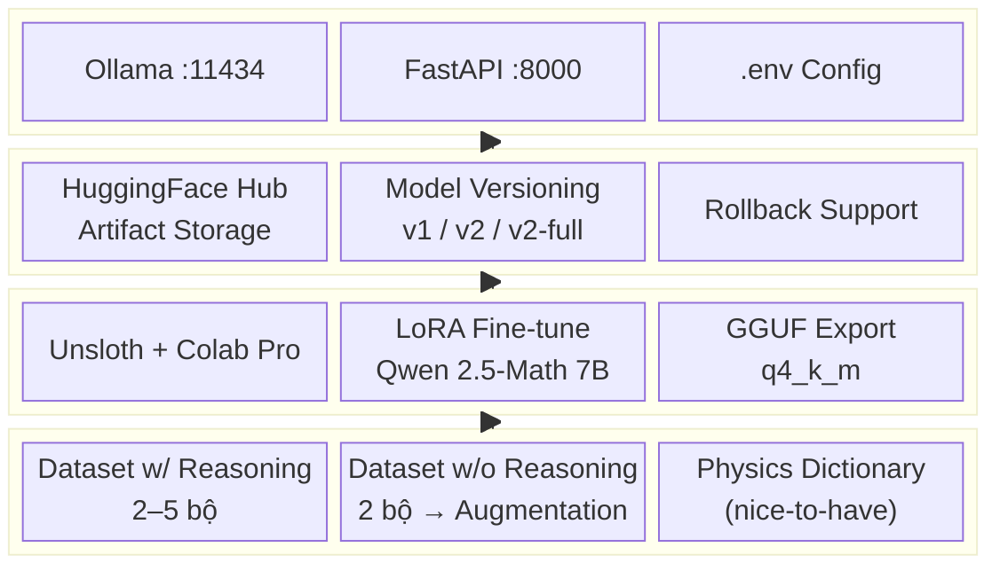
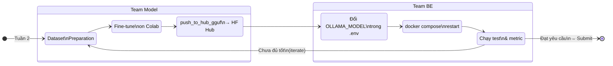

# MLOps Pipeline — Laplace's Red Devils

## 1. System Architecture

```mermaid
architecture-beta
    group colab(cloud)[Team Model — Google Colab Pro]
        service training(server)[Unsloth\nFine-tuning]
        service export(disk)[GGUF Export\nq4_k_m]
    end

    group hub(cloud)[HuggingFace Hub]
        service registry(disk)[Model Registry\nlaplaces-red-devils/]
    end

    group localinfra(server)[Team BE — Local Infrastructure]
        group docker(server)[Docker]
            service ollama(server)[Ollama\n:11434]
            service api(internet)[FastAPI\n:8000]
        end
        service envconfig(disk)[.env\nOLLAMA_MODEL]
    end

    training:R --> L:export
    export:R --> L:registry
    envconfig:R --> L:ollama
    registry:B --> T:ollama
    ollama:R --> L:api
```

---

## 2. Team Boundaries & Interface Contract

```mermaid
architecture-beta
    group modelTeam(cloud)[Team Model — Nguyên + Sơn]
        service dataset(disk)[Dataset\nPreparation]
        service finetune(server)[Fine-tune\nQwen 2.5-Math 7B]
        service gguf(disk)[GGUF Artifact\n.Q4_K_M]
    end

    group contract(cloud)[Interface Contract]
        service hfhub(disk)[HuggingFace Hub\nhf.co/laplaces-red-devils/\nmodel:Q4_K_M]
    end

    group beTeam(server)[Team BE — Dương + Quang]
        service config(disk)[.env Config]
        service ollamaS(server)[Ollama\nSelf-hosted]
        service pipeline(server)[QA Pipeline\nLangGraph]
        service endpoint(internet)[API Endpoint\n:8000]
    end

    gguf:R --> L:hfhub
    hfhub:R --> L:config
    config:R --> L:ollamaS
    ollamaS:R --> L:pipeline
    pipeline:R --> L:endpoint
```

---

## 3. MLOps Layers

```mermaid
block-beta
    columns 1

    block:serving["🚀 Serving Layer"]:1
        A["Ollama :11434"]
        B["FastAPI :8000"]
        C[".env Config"]
    end

    block:registry["📦 Registry Layer"]:1
        D["HuggingFace Hub\nArtifact Storage"]
        E["Model Versioning\nv1 / v2 / v2-full"]
        F["Rollback Support"]
    end

    block:training["🧪 Training Layer"]:1
        G["Unsloth + Colab Pro"]
        H["LoRA Fine-tune\nQwen 2.5-Math 7B"]
        I["GGUF Export\nq4_k_m"]
    end

    block:data["📊 Data Layer"]:1
        J["Dataset w/ Reasoning\n2–5 bộ"]
        K["Dataset w/o Reasoning\n2 bộ → Augmentation"]
        L["Physics Dictionary\n(nice-to-have)"]
    end

    data --> training
    training --> registry
    registry --> serving
```

---

## 4. Iteration Loop

```mermaid
stateDiagram-v2
    direction LR

    [*] --> DataPrep : Tuần 2

    state "Team Model" as TM {
        DataPrep : Dataset\nPreparation
        Finetune : Fine-tune\non Colab
        PushHub  : push_to_hub_gguf\n→ HF Hub
    }

    state "Team BE" as TB {
        UpdateEnv : Đổi OLLAMA_MODEL\ntrong .env
        Restart   : docker compose\nrestart
        Evaluate  : Chạy test\n& metric
    }

    DataPrep --> Finetune
    Finetune --> PushHub
    PushHub  --> UpdateEnv
    UpdateEnv --> Restart
    Restart   --> Evaluate

    Evaluate --> DataPrep : Chưa đủ tốt\n(iterate)
    Evaluate --> [*]      : Đạt yêu cầu\n→ Submit
```
